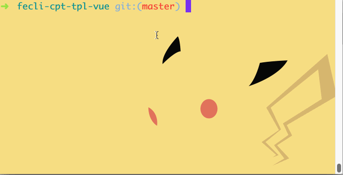
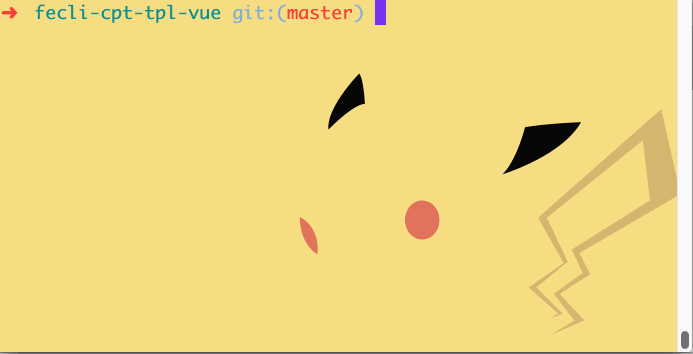

# vcmd
> 本地运行 Vue.js 组件的命令行管理工具。主要是利用 [@fe6/fecli](https://www.npmjs.com/package/@fe6/fecli) 自动化创建出来的[Vue.js 组件模板](https://github.com/iq9891/fecli-cpt-tpl-vue) 本地开发及打包用的.

[](https://www.npmjs.org/package/@fe6/vcmd)
[](https://npmjs.org/package/@fe6/vcmd)
[](https://npmjs.org/package/@fe6/vcmd)

## 使用

```
$ fe6vc server
$ fe6vc build
```

package.json 默认配置

```
({
  "fe6vcmd": { // 打包配置
    "publicFolder": "example", // 公共的本地开发的目录
    "entryStyleFile": "index.ts", // css 入口文件
    "entryStyleFolder": "style", // css 入口文件夹
    "entryFile": "index.ts", // js 入口文件
    "entryFolder": "component", // js 入口文件夹
    "outputFolder": "dist", // 打包输出的文件夹
    "rootFolder": "src", // 源文件的根目录
    "port": 3000 // 本地开发的端口
  }
})
```

## 命令的功能

### fe6vc server
  - style
    - 语法检测
    - sass 转译 css
  - ts
    - 语法检测
    - ts 转译
  - html
    - 渲染 vue
    - 实时编译



### fe6vc build
  - style
    - 语法检测
    - sass 转译 css
    - 压缩
    - postcss 低版本兼容
  - js
    - 语法检测
    - ts 转译
    - 打包
    - 语法低版本兼容



## 更新历史

### 0.1.0
   - 本地开发命令 `fe6vc server` 或者 `fe6vc s` [#2b099c6](https://github.com/fe6/vcmd/pull/1/commits/45ff9d46a4461720449f74b755c874a93d4ab9ca)
   - 本地打包压缩版命令 `fe6vc build` 或者 `fe6vc b` [#45ff9d4](https://github.com/fe6/vcmd/pull/1/commits/45ff9d46a4461720449f74b755c874a93d4ab9ca)
